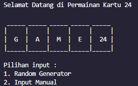

# Tugas Kecil 1 Strategi Algoritma

> __Permainan Kartu 24__. Program ini merupakan program yang dapat mencari cara untuk mengubah 4 angka random (baik digenerate sendiri ataupun menggunakan generator) sehingga mendapatkan hasil akhir sejumlah 24.
> Permainan kartu 24 dicari dengan 13 kartu (As, 2, 3, 4, 5, 6, 7, 8, 9, 10, Jack, Queen, dan King) dimana yang diperhatikan hanya nilai kartu yang didapat (As == 1, Jack == 11, Queen == 12, King == 13) dengan dilakukan operasi dasar matematika penjumlahan (+), pengurangan (-), perkalian (×), divisi (/) dan tanda kurung ( () ).

## Daftar Isi
* [Technologies Used](#technologies-used)
* [Features and Commands](#features-and-commands)
* [Sistematika File](#sistematika-file)
* [Cara Menjalankan Program](#cara-menjalankan-program)
* [Screenshots](#screenshots)
* [Project Status](#project-status)
* [Creator](#creator)


## Technologies Used
* Bahasa: C++ 

## Features and Commands
* Menerima input baik berupa input user maupun random generator
* Memberikan validasi jika inputan kurang tepat
* Menampilkan berapa banyak kemungkinan angka-angka tersebut membentuk 24

## Sistematika File
*On Progress*
```bash
.
├─── bin
│   ├─── main.exe
├─── doc
│   ├─── Tucil1_Stima_2023.pdf
│   ├─── Tucil1_K2_13521084_Austin Gabriel Pardosi.pdf
├─── src
│   ├─── main.cpp
├─── test
│   ├─── output.txt
└─── README.md
```

## Cara Menjalankan Program
* Program ini berhasil dijalankan dan dites di OS Windows 11 dan dengan compiler GNU C++ (G++) versi 8.1.0
* Program belum sepenuhnya dites pada environment lain dan tidak dispesifikasikan untuk dapat dijalankan di semua environment, sehingga jika ingin dilakukan tes kembali, mohon gunakan environment yang sama untuk hasil yang serupa.

## Screenshots


## Project Status

| Poin                                                                 | Ya            | Tidak  |
| -------------------------------------------------------------------- |:-------------:| -----: |
| Program berhasil dikompilasi tanpa kesalahan                         | [x]           |        |
| Program berhasil running                                             | [x]           |        |
| Program dapat membaca input / generate sendiri dan memberikan luaran | [x]           |        |
| Solusi yang diberikan program memenuhi (berhasil mencapai 24)        | [x]           |        |
| Program dapat menyimpan solusi dalam file teks                       | [x]           |        |

## Creator
* Austin Gabriel Pardosi
* 13521084
* Teknik Informatika 2021